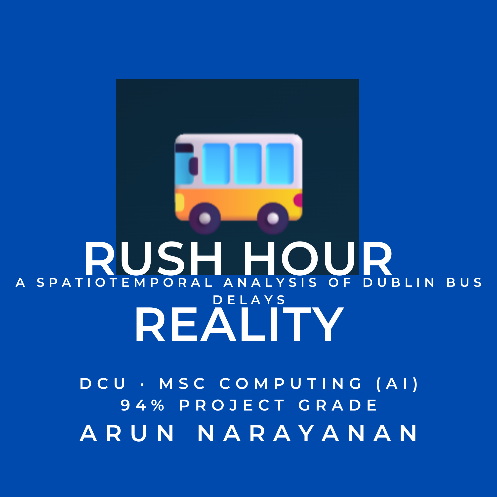
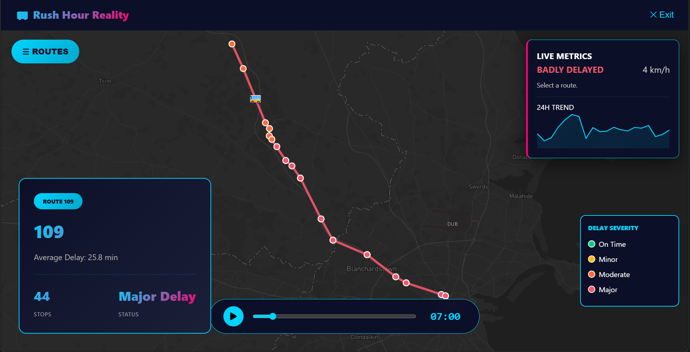
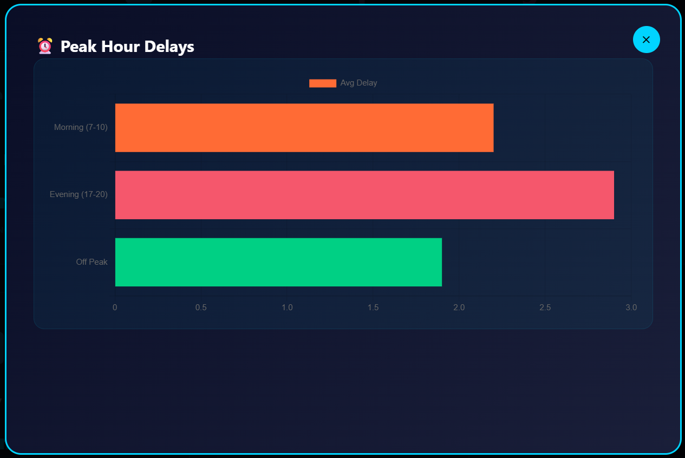
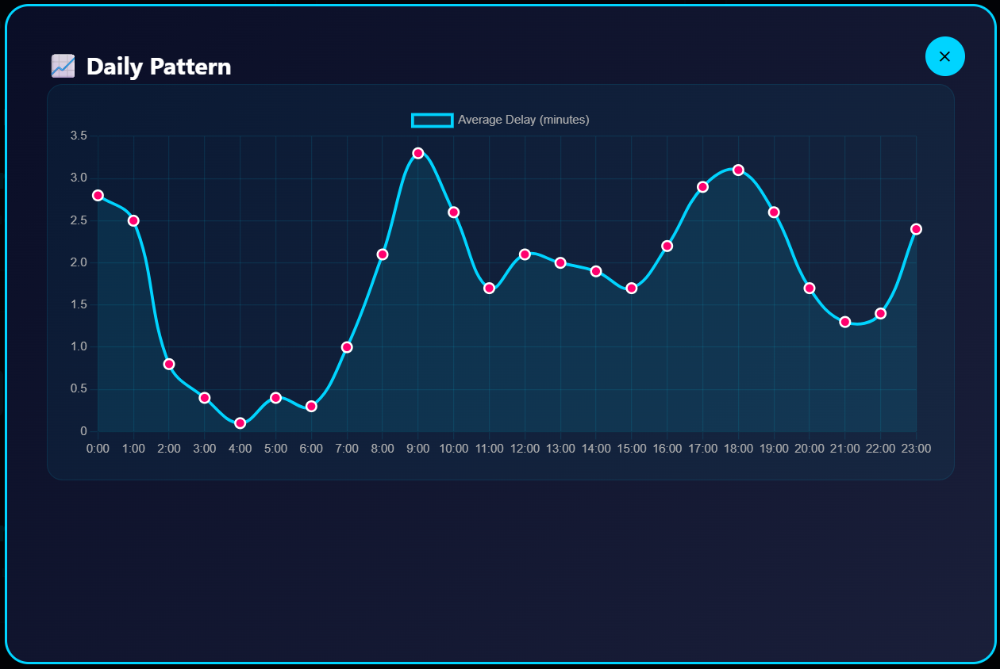

# Rush Hour Reality: A Spatiotemporal Analysis of Dublin Bus Delays
> Uneven rush hour patterns across Dublin revealed through real-time GTFS data and animated geospatial maps.



[](LICENSE)
[](https://www.python.org/)
[](https://jupyter.org/)


## Project Overview

**Context:** CSC1143/CSC1175 Data Visualisation Assignment, MSc Computing (AI), Dublin City University, Group ZA.  

**Duration:** 1 November 2025 – 2 December 2025  

**Grade:** 94% (project mark)  

**Summary:** Rush Hour Reality investigates how bus delays evolve across Dublin over a full 24‑hour cycle, showing that “rush hour” is not a single city-wide event but a localized phenomenon affecting different regions in very different ways.

**Problem Statement**  
Does Dublin gridlock uniformly during rush hour, or are delays concentrated on specific routes and regions? The project highlights commuting inequality, where a passenger in the City Centre can move relatively freely while a commuter travelling through West Dublin faces significant stagnation.

## Key Findings

- Rush hour is geographically uneven: routes serving West Dublin experience “Badly Delayed” status (> 10 minutes) far more frequently than North or Central routes.  
- Central Dublin maintains better flow during peak windows, likely due to dedicated bus corridors and infrastructure that keep buses moving.  
- Severe delays cluster into two peak windows, 07:00–10:00 and 17:00–20:00, where congestion visibly builds up on specific corridors in the animated map.  
- An animated geospatial visualization driven by real-time GTFS data lets users “play” through a 24‑hour cycle and feel delay, as badly delayed buses move more slowly along their routes than on-time services.

## Tech Stack

| Component       | Technology                                                                                           |
|-----------------|------------------------------------------------------------------------------------------------------|
| Data Sources    | NTA/TFI GTFS‑Realtime (TripUpdates, VehiclePositions) + GTFS Static (routes.txt, stops.txt). |
| Data Collection | Python script scheduled with Windows Task Scheduler every 30 minutes for 13 days (~1.5M records). |
| Data Processing | Python, Polars, gtfs‑realtime‑bindings, Google Colab.                                               |
| Visualization   | Mapbox GL JS, Turf.js, Chart.js (HUD sparklines).                                                   |
| Frontend & UI   | HTML, CSS, JavaScript (animated geospatial node‑link diagram with time slider and regional filters). |


## Repository Structure

- `rush_hour_data/` – Raw and processed datasets plus a data dictionary.
- `notebooks/` – Numbered Jupyter notebooks for each analysis phase (exploration, cleaning, aggregation).
- `dashboards/` – Interactive HTML visualization artifacts (Mapbox GL JS dashboard and assets).
- `outputs/` – Generated figures, screenshots, and report PDFs.
- `LICENSE` – MIT License for the project.
- `README.md` – This documentation.

---

## Getting Started

### 1. Prerequisites

- Python 3.12+  
- Jupyter Notebook or JupyterLab  
- Git  

### 2. Installation

```bash
git clone https://github.com/ArunGMR0411/rush-hour-reality.git
cd rush-hour-reality
```

### 3. Run the Notebooks

```bash
jupyter notebook
```

Open:

- `notebooks/01_data_collection_and_cleaning.ipynb`  
- `notebooks/02_data_processing_and_visualization.ipynb`

---

## Analysis Workflow

1. **Data Collection**  
   - Poll GTFS‑Realtime TripUpdates and VehiclePositions from the National Transport Authority every 30 minutes using a scheduled Python script (Windows Task Scheduler) over 13 days (~1.5M records).  
   - Combine this with GTFS Static schedule files (routes.txt, stops.txt) from Transport for Ireland.  

2. **Data Cleaning and Transformation**  
   - Decode Protobuf feeds using `gtfs-realtime-bindings`.  
   - Filter to the Greater Dublin Area (lat 53.15–53.60, lon −6.60 to −6.00) to exclude intercity services.  
   - Derive `delay_minutes` from scheduled vs actual arrival times and remove obvious errors/outliers.  

3. **Exploratory Data Analysis**  
   - Identify critical rush windows (07:00–10:00 and 17:00–20:00).  
   - Aggregate delay distributions by region (Central, North, West, South) to locate bottlenecks.  
   - Use temporal trend plots to calibrate the animation timeline for the final visualisation.  

4. **Visualisation and Dashboard**  
   - Aggregate data into a 24‑hour “typical day” model for each route and stop.  
   - Feed these aggregates into a Mapbox GL JS–based animated node‑link map, with Turf.js for movement and Chart.js for the HUD sparkline.  
   - Package the final HTML/JS artifact inside `dashboards/` for easy hosting via GitHub Pages or another static host.

---

## Key Insights

- **Uneven rush hour:** West Dublin routes hit “Badly Delayed” status (> 10 minutes) much more often than Central or North Dublin routes.  
- **Infrastructure resilience:** Central Dublin’s bus corridors help maintain movement, even during peak periods.  
- **Peak congestion windows:** Delay intensity is highest between 07:00–10:00 and 17:00–20:00, with visible build‑up on specific corridors in the animation.  
- **Experiential visualisation:** Slower‑moving icons for badly delayed buses make the network’s “pulse” and commuter experience intuitive.  


## Dashboard Preview



- Animated Mapbox GL JS dashboard showing bus movement and delay status across Dublin over a 24‑hour cycle.  
- Time slider to scrub through the day and inspect specific rush windows.  
- HUD sparkline summarising average delay across the network in real time.  





**Live Dashboard:** 

## Methodology

- **Data sources**  
  - National Transport Authority / Transport for Ireland GTFS‑Realtime APIs (TripUpdates, VehiclePositions).  
  - GTFS Static schedules (routes.txt, stops.txt) providing route names and stop coordinates.  

- **Analysis techniques**  
  - Time‑based aggregation to build a 24‑hour “typical day” delay profile.  
  - Spatiotemporal grouping by region (Central, North, West, South Dublin).  
  - Thresholding into delay bands (“On Time”, “Slight”, “Moderate”, “Badly Delayed”) for traffic‑light colour mapping.  

- **Validation methods**  
  - Geographic filtering to the Greater Dublin Area to remove out‑of‑scope services.  
  - Manual spot‑checks of sampled trips against published schedules.  
  - Sanity checks on delay distributions to catch extreme or invalid values.  

---

## Learning Outcomes

Reflecting on this assignment, I:

- Strengthened my **data engineering** skills by building an automated pipeline that collected ~1.5M GTFS‑Realtime records over 13 days using scheduled Python scripts.  
- Learned to work with **big, semi‑structured transport data**, including Protobuf decoding, geospatial joins, and high‑performance aggregation with Polars.  
- Deepened my **data visualisation** and UX thinking by moving from static maps to an animated, exploratory dashboard that communicates the “pulse” of the network.  
- Gained experience in **collaborative project delivery**, balancing responsibilities across data collection, processing, visual design, and report writing.  

---

## Future Enhancements

Planned ideas to extend Rush Hour Reality:

- Integrate a **real‑time data pipeline** that streams directly from the NTA API for live delay monitoring.  
- Add **predictive modelling** to forecast delays on key routes using historical patterns.  
- Build a **mobile‑responsive interface** so commuters can explore delay patterns on phones and tablets.  
- Enrich the model with **external factors** such as weather or major events to analyse their impact on congestion.  

---

## Contact

**Arun Narayanan**  
MSc Computing (Artificial Intelligence) – Dublin City University  

- LinkedIn: https://www.linkedin.com/in/arun-narayanan-gmr/  
- GitHub: https://github.com/ArunGMR0411  
- Email: arun4gmr@gmail.com

I’m happy to receive feedback, questions, or collaboration ideas related to transport analytics, data engineering, or visualisation.  

---

## Acknowledgments

- DCU faculty who supervised and assessed the CSC1143/CSC1175 Data Visualisation assignment.  
- National Transport Authority / Transport for Ireland for making GTFS‑Realtime and GTFS Static data publicly available.  
- Open‑source projects used in this work, including Python, Polars, Mapbox GL JS, Turf.js, Chart.js, and related libraries.  
